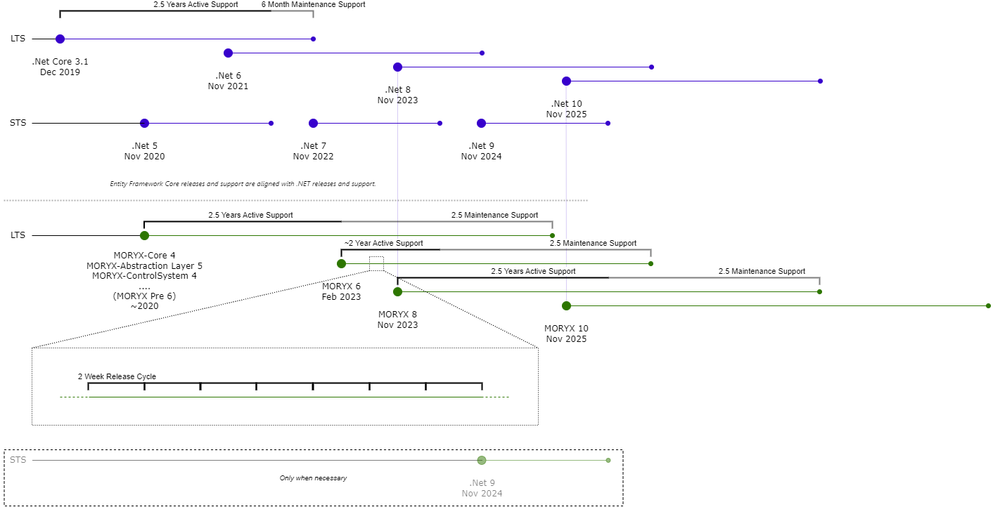

# Release Schedule

For your customers, partners and for the long-term planning MORYX has commited on the [.Net release schedule](https://dotnet.microsoft.com/en-us/platform/support/policy/dotnet-core).

## MORYX Release Lifecycle

### Supported Versions

| Verions | Original release date | End of active support | End of maintenance support |
|---------|-----------------------|-----------------------|----------------------------|
| MORYX 10 | ~ Nov 2025 | ~ May 2028  | ~ Nov 2030  |
| MORYX 8 | Nov 2023 | ~ May 2026  | ~ Nov 2028  |
| MORYX 6 | Feb, 20 2023 | ~ May 2024  | ~ Nov 2026  |
| pre MORYX 6 | several | ~ Feb, 20 2023  | ~ Nov 2025  |

### MORYX Release Cadence

*Note: The adjustement to the regular support periods is a process. MORYX 8 will be the first release fully adheering to the support period definitions in the subsequent paragraphs.*

Updates are released on every second friday, however there is no guarantee that there will be a MORYX release on any given Release Friday. Releases are announced in the MORYX channel.

## Active Support

During the active support period, MORYX releases are updated to improve functional capabilities and mitigate security vulnerabilities.

The active support period are the first 2.5 years of support for any release. After the active period ends, the release is under maintenance support.

## Maintenance Support

During the maintenance support period, MORYX releases are updated to mitigate security vulnerabilities and critical bugs, only.

The maintenance support period are the final 2.5 years of support for any release. After the maintenance period ends, the release is out of support.

## End of life (EOL)

End of life refers to the date when MORYX Industry no longer provides fixes, updates, or online technical assistance. End of life may also be referred to as 'end of support' (EOS).

As the end of life nears for a given MORYX version, it is recommended that you move to a newer MORYX version, and reduce/remove your use of the given MORYX version. After support ends, it is recommended that you uninstall a given MORYX version if you are no longer using it, or install the latest patch, and accelerate your plans to remove your use of that MORYX version.

Your use of out-of-support MORYX versions may put your applications, application data, and computing environment at risk. You are strongly recommended to not use out-of-support software.

## Excerpts from the Discussions

Initial Assumptions:

- MORYX is a small team
- MORYX will always have multiple versions of the software in production
- MORYX needs to provide transition periods between versions for application developers
- MORYX needs to build our software on dependencies which are patched to match security requirements in production facilities
- MORYX needs to be able to introduce features quickly to satisfy customers and partners

Conclusions:

- MORYX only transitions from one .Net LTS version to the next.  
This minimizes cost of migrations between .Net version (for the product and aplication development)  
Nevertheless, you are always building on a patched and supported version of .Net
- The version numbers are keeped aligned with .Net  
This simplifies the usage of packages for application developers
This generally allows for one unanounced major releases within the normal release cycle to provide urgent API changes for a customer. **(Only if really, really needed)**
- The maintenance period is extended from 6 month to 30 month while the active support period stays unchanged compared to .Net.  
The longer maintenance period should give customers a better feeling when buying the software.
The limited active support period should motivate to quickly move to new MORYX Versions (as the cost of each new feature is multiplied with the number of releases it is provided for)  
Not many bugs are expected to be found on the older releases after a newer version is on the market and new machines are build with that one.  
Not many bugs are expected to be found on the older releases after a newer version is on the market and new machines are build with that one.  
